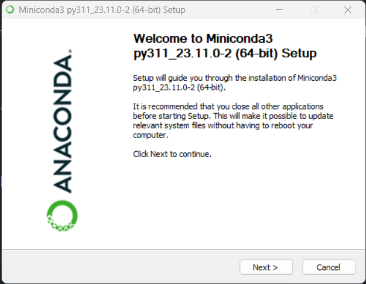
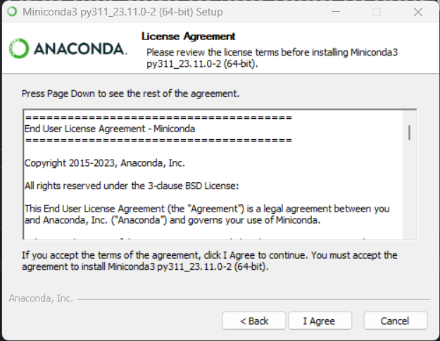
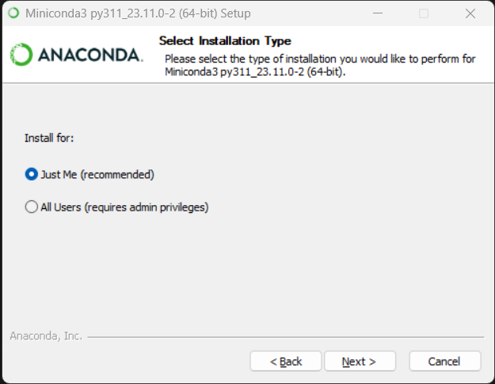
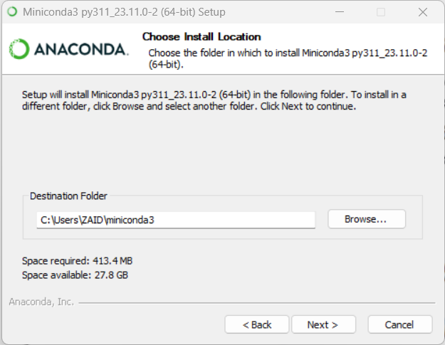
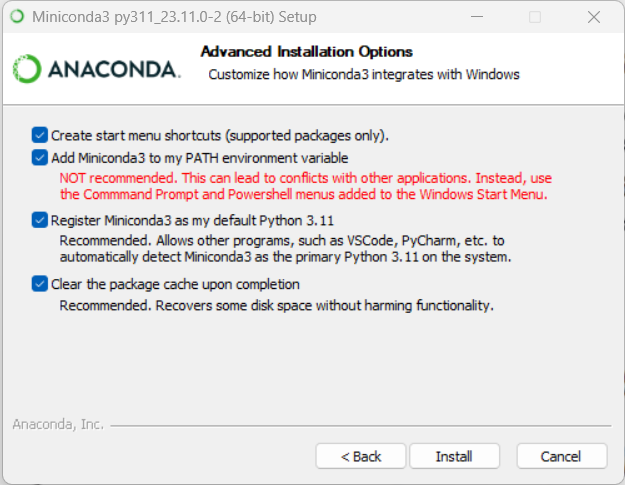

# Django Setup Guide 2024
[< Back](README.md)


Welcome to the Django Website Setup Guide! This guide is designed to help you set up a Django web development environment for creating powerful and dynamic web applications. This guide will walk you through the installation of the necessary tools and software, as well as the creation of a new Django project.
## Table of Contents
- [Miniconda](#miniconda)
- [Git](#git)
- [VSCode](#vscode)
- [VSCode Extensions](#vscode-extensions)
- [Git Configuration](#git-configuration)
- [Django](#django)
- [Docker](#docker)
- [Django Project](new_blank_website.md)

## Prerequisites
- Windows 11/10
- Internet Connection
- Basic Computer Skills

## Installation

### Miniconda

Miniconda is a minimal distribution of Conda, a package manager for Python. It is recommended for managing your Python environments.

1. **Download Miniconda:**
   - Visit the [Miniconda website](https://docs.conda.io/en/latest/miniconda.html) and download the appropriate installer for your operating system.

2. **Install Miniconda:**
   step 1: open the installer and click next
   
   
   
   step 2: click on "I agree" and then click next
   
   
   
   step 3: select "Just Me" and click next

   
   
   step 4: press next, if any warning comes, change the location to C:\miniconda3 and press next
   
   
   
   step 5: Check all the boxes and click install
   
   

### Git

Git is a version control system that will help you track changes in your code.

1. **Download Git:**
   - Visit the [Git website](https://git-scm.com/downloads) and download the installer for your operating system.

2. **Install Git:**
   - dont change any setting, keep pressing next and it will be installed. close allter

### VSCode

Visual Studio Code (VSCode) is a powerful code editor that provides excellent support for Python development.

1. **Download VSCode:**
   - Visit the [VSCode website](https://code.visualstudio.com/) and download the installer for your operating system.

2. **Install VSCode:**
   - Follow the installation steps and check all the boxes and click install

### VSCode Extensions

Enhance your VSCode experience with the following extensions:

1. **Python Extension:**
   - Open VSCode.
   - Navigate to the Extensions view (`Ctrl + Shift + X`).
   - Search for "Python" and install the one provided by Microsoft.
   
2. **SQLite3 Editor Extension:**
   - Open VSCode.
   - Navigate to the Extensions view (`Ctrl + Shift + X`).
   - Search for "SQLite" and install the "SQLite" extension.

3. **VSCode Icons:**
   - Open VSCode.
   - Navigate to the Extensions view (`Ctrl + Shift + X`).
   - Search for "VSCode Icons" and install the one you prefer.

4. **Djaneiro - Django Snippets**
    - Open VSCode.
    - Navigate to the Extensions view (`Ctrl + Shift + X`).
    - Search for "Djaneiro" and install the one provided by Scott Barkman.

5. **django-snippets**
    - Open VSCode.
    - Navigate to the Extensions view (`Ctrl + Shift + X`).
    - Search for "django-snippets" and install the one provided by Siddharth Singha Roy.

6. **htmx-tags**
    - Open VSCode.
    - Navigate to the Extensions view (`Ctrl + Shift + X`).
    - Search for "htmx-tags" and install the one provided otovo-oss.

7. **Docker**
    - Open VSCode.
    - Navigate to the Extensions view (`Ctrl + Shift + X`).
    - Search for "Docker" and install the one provided by Microsoft.

8. **Bootstrap 5 Quick Snippets**
    - Open VSCode.
    - Navigate to the Extensions view (`Ctrl + Shift + X`).
    - Search for "Bootstrap 5 Quick Snippets" and install the one provided by Anbuselvan Rocky.

### Git Configuration
`(create an account on github.com if you don't have one already)`
open your terminal and run the following commands to configure your Git username and email:

```bash
git config --global user.name "Your Name"
```
```bash
git config --global user.email "your.email@example.com"
```

Replace "Your Name" and "your.email@example.com" with your actual name and email.

### Django

Open your terminal and run the following commands to install Django:

```bash
pip install django
```

### Docker (can be done later)

To install Docker, visit the [Docker website](https://www.docker.com/products/docker-desktop) and download the installer for your operating system.
Click on the installer and follow the installation steps. 
---
open this link [Django Project](new_blank_website.md) to continue create a new Django project website
